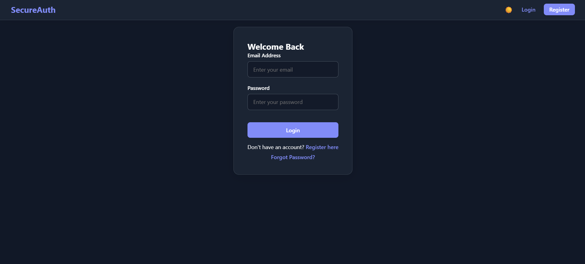
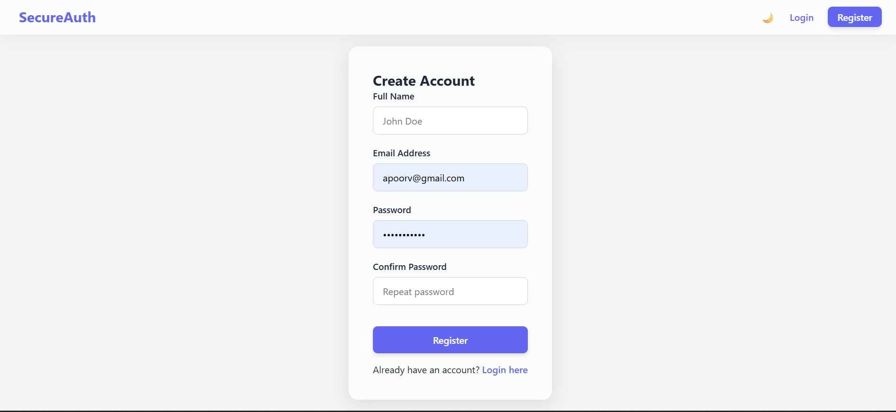
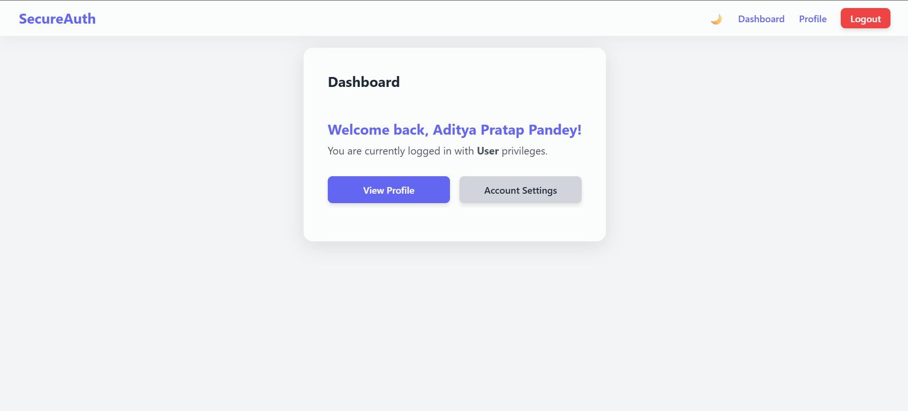
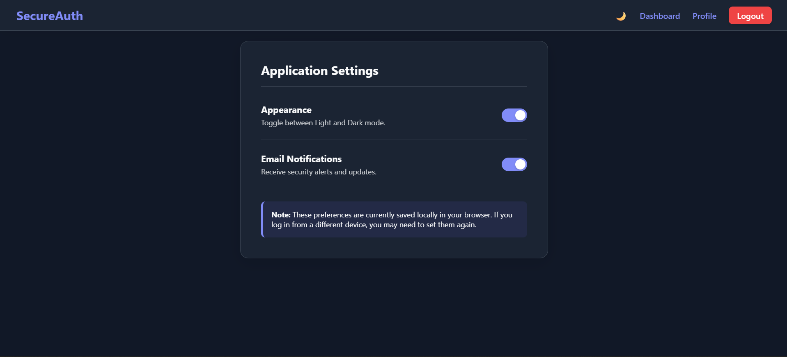

# 🛡️ SecureAuth

A production-ready, full-stack authentication system built with the **MERN Stack**. SecureAuth provides a complete authentication and authorization solution with **JWT Authentication**, **Role-Based Access Control (RBAC)**, password hashing, and a modern **Glassmorphism UI** with Dark Mode support.

---

## 📖 Table of Contents

- [Features](#-features)
- [Tech Stack](#-tech-stack)
- [Project Structure](#-project-structure)
- [Getting Started](#-getting-started)
- [Environment Variables](#-environment-variables)
- [API Endpoints](#-api-endpoints)
- [Authentication Flow](#-authentication-flow)
- [Screenshots](#-screenshots)
- [Future Improvements](#-future-improvements)
- [Contributing](#-contributing)
- [License](#-license)
- [Author](#-author)

---

# ✨ Features

### 🔐 Authentication
- User Registration
- User Login
- Secure Logout
- JWT Authentication
- Protected Routes
- Persistent Login Sessions

### 🛡️ Security
- Password hashing using **bcryptjs**
- JSON Web Token authentication
- Role-Based Access Control (RBAC)
- Secure HTTP headers using **Helmet**
- CORS Protection
- Environment Variable Configuration
- Input Validation
- Error Handling Middleware

### 👤 User Roles
- **Admin**
  - Manage users
  - Access admin-only routes
- **User**
  - Access protected dashboard
  - Update profile

### 🎨 User Interface
- Modern Glassmorphism Design
- Fully Responsive Layout
- Dark Mode / Light Mode
- Smooth Animations
- Mobile Friendly
- Clean Dashboard

### ⚡ Performance
- Fast Vite Development Server
- Optimized React Components
- Context API for Global State
- Modular Backend Architecture

---

# 🛠️ Tech Stack

## Frontend

- React.js (Vite)
- React Router DOM
- Axios
- Context API
- CSS3
- CSS Variables
- Glassmorphism UI

---

## Backend

- Node.js
- Express.js
- MongoDB Atlas
- Mongoose
- JSON Web Tokens (JWT)
- bcryptjs
- Helmet
- CORS
- dotenv

---

# 📂 Project Structure

```text
SecureAuth/
│
├── backend/
│   ├── config/
│   │   └── db.js
│   │
│   ├── controllers/
│   │   └── authController.js
│   │
│   ├── middleware/
│   │   ├── authMiddleware.js
│   │   ├── roleMiddleware.js
│   │   └── errorMiddleware.js
│   │
│   ├── models/
│   │   └── User.js
│   │
│   ├── routes/
│   │   └── authRoutes.js
│   │
│   ├── utils/
│   │   └── generateToken.js
│   │
│   ├── .env
│   ├── package.json
│   └── server.js
│
├── frontend/
│   ├── public/
│   │
│   ├── src/
│   │   ├── assets/
│   │   ├── components/
│   │   ├── context/
│   │   ├── pages/
│   │   ├── services/
│   │   ├── App.jsx
│   │   ├── main.jsx
│   │   └── index.css
│   │
│   ├── package.json
│   └── vite.config.js
│
├── README.md
└── .gitignore
```

---

# 🚀 Getting Started

## Prerequisites

Before starting, make sure you have installed:

- Node.js (v18 or above)
- npm
- MongoDB Atlas account (or Local MongoDB)
- Git

---

## 1️⃣ Clone the Repository

```bash
git clone https://github.com/your-username/secure-auth.git

cd secure-auth
```

---

## 2️⃣ Backend Setup

Navigate to the backend folder.

```bash
cd backend
```

Install dependencies.

```bash
npm install
```

Create a `.env` file.

```env
PORT=5000
NODE_ENV=development

MONGO_URI=mongodb+srv://<username>:<password>@cluster.mongodb.net/

JWT_SECRET=your_super_secret_key

JWT_EXPIRE=30d

FRONTEND_URL=http://localhost:5173
```

Start the backend server.

```bash
npm run dev
```

Backend runs on

```
http://localhost:5000
```

---

## 3️⃣ Frontend Setup

Open another terminal.

Navigate to frontend.

```bash
cd frontend
```

Install dependencies.

```bash
npm install
```

Start Vite.

```bash
npm run dev
```

Frontend runs on

```
http://localhost:5173
```

---

# 🔐 Environment Variables

Inside `/backend/.env`

```env
PORT=5000

NODE_ENV=development

MONGO_URI=your_mongodb_connection_string

JWT_SECRET=your_super_secret_key

JWT_EXPIRE=30d

FRONTEND_URL=http://localhost:5173
```

---

# 📡 API Endpoints

## Authentication

### Register

```http
POST /api/auth/register
```

Request

```json
{
  "name": "John Doe",
  "email": "john@gmail.com",
  "password": "123456"
}
```

---

### Login

```http
POST /api/auth/login
```

Request

```json
{
  "email": "john@gmail.com",
  "password": "123456"
}
```

---

### Logout

```http
POST /api/auth/logout
```

---

### Forgot Password

```http
POST /api/auth/forgot-password
```

---

### Reset Password

```http
POST /api/auth/reset-password/:token
```

---

# 🔄 Authentication Flow

```text
User
   │
   ▼
Register/Login
   │
   ▼
Backend Validation
   │
   ▼
Password Hashing (bcrypt)
   │
   ▼
JWT Token Generated
   │
   ▼
Token Sent to Frontend
   │
   ▼
Stored in Context/API
   │
   ▼
Protected Routes Accessible
```

---

## 📸 Screenshots

### Login Page



### Register Page



### Dashboard



### Dark Mode


---

# 🚀 Future Improvements

- Email Verification
- Google OAuth
- GitHub OAuth
- Refresh Tokens
- Two-Factor Authentication (2FA)
- User Profile Management
- Profile Image Upload
- Admin Dashboard Analytics
- Docker Support
- Unit & Integration Testing
- CI/CD Pipeline

---

# 🤝 Contributing

Contributions are welcome.

1. Fork the repository

2. Create a feature branch

```bash
git checkout -b feature-name
```

3. Commit your changes

```bash
git commit -m "Added new feature"
```

4. Push the branch

```bash
git push origin feature-name
```

5. Open a Pull Request

---

# 📜 License

This project is licensed under the MIT License.

---

# 👨‍💻 Author

**Aditya Pratap Pandey**

GitHub: https://github.com/AdityaPPandey27

LinkedIn: https://www.linkedin.com/in/aditya-pratap-pandey-875b36273/


---

## ⭐ Support

If you found this project useful, consider giving it a ⭐ on GitHub.

It helps others discover the project and motivates future improvements.

---

> **SecureAuth** — A secure, scalable, and production-ready MERN authentication system built with modern web technologies.